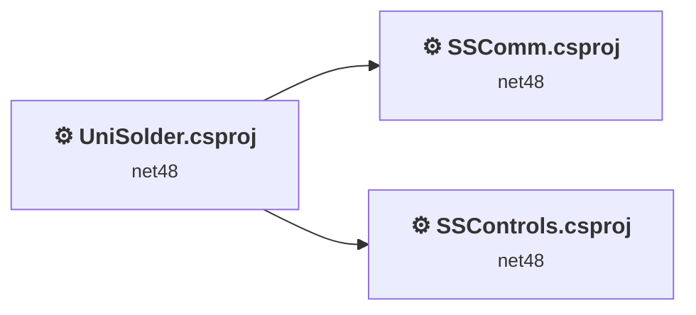
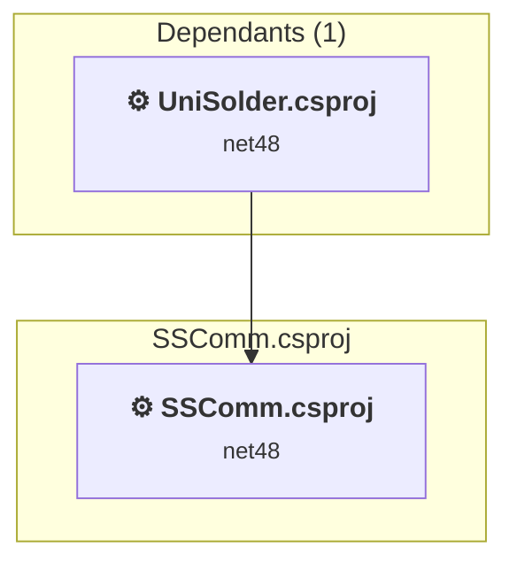
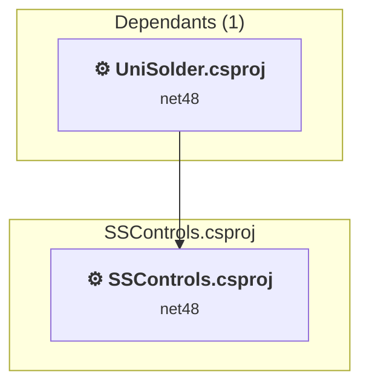
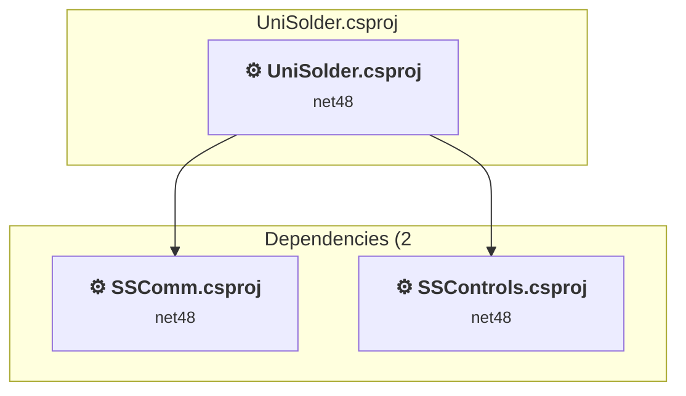

# Projects and dependencies analysis

This document provides a comprehensive overview of the projects and their dependencies in the context of upgrading to .NETCoreApp,Version=v10.0.

## Table of Contents

- [Executive Summary](#executive-Summary)
  - [Highlevel Metrics](#highlevel-metrics)
  - [Projects Compatibility](#projects-compatibility)
  - [Package Compatibility](#package-compatibility)
  - [API Compatibility](#api-compatibility)
  - [Binding Redirect Configuration](#binding-redirect-configuration)
- [Aggregate NuGet packages details](#aggregate-nuget-packages-details)
- [Top API Migration Challenges](#top-api-migration-challenges)
  - [Technologies and Features](#technologies-and-features)
  - [Most Frequent API Issues](#most-frequent-api-issues)
- [Projects Relationship Graph](#projects-relationship-graph)
- [Project Details](#project-details)

  - [SSComm\SSComm.csproj](#sscommsscommcsproj)
  - [SSControl\SSControls.csproj](#sscontrolsscontrolscsproj)
  - [UniSolder\UniSolder.csproj](#unisolderunisoldercsproj)

## Executive Summary

### Highlevel Metrics

| Metric | Count | Status |
| :--- | :---: | :--- |
| Total Projects | 3 | All require upgrade |
| Total NuGet Packages | 0 | All compatible |
| Total Code Files | 21 |  |
| Total Code Files with Incidents | 11 |  |
| Total Lines of Code | 4920 |  |
| Total Number of Issues | 1665 |  |
| Estimated LOC to modify | 1659+ | at least 33,7% of codebase |

### Projects Compatibility

| Project | Target Framework | Difficulty | Package Issues | API Issues | Binding Issues | Est. LOC Impact | Description |
| :--- | :---: | :---: | :---: | :---: | :---: | :---: | :--- |
| [SSComm\SSComm.csproj](#sscommsscommcsproj) | net48 | 🟢 Low | 0 | 11 | 0 | 11+ | ClassicWinForms, Sdk Style = False |
| [SSControl\SSControls.csproj](#sscontrolsscontrolscsproj) | net48 | 🟡 Medium | 0 | 95 | 0 | 95+ | ClassicWinForms, Sdk Style = False |
| [UniSolder\UniSolder.csproj](#unisolderunisoldercsproj) | net48 | 🟡 Medium | 0 | 1553 | 0 | 1553+ | ClassicWinForms, Sdk Style = False |

### Package Compatibility

| Status | Count | Percentage |
| :--- | :---: | :---: |
| ✅ Compatible | 0 | 0,0% |
| ⚠️ Incompatible | 0 | 0,0% |
| 🔄 Upgrade Recommended | 0 | 0,0% |
| ***Total NuGet Packages*** | ***0*** | ***100%*** |

### API Compatibility

| Category | Count | Impact |
| :--- | :---: | :--- |
| 🔴 Binary Incompatible | 1539 | High - Require code changes |
| 🟡 Source Incompatible | 118 | Medium - Needs re-compilation and potential conflicting API error fixing |
| 🔵 Behavioral change | 2 | Low - Behavioral changes that may require testing at runtime |
| ✅ Compatible | 2852 |  |
| ***Total APIs Analyzed*** | ***4511*** |  |

## Aggregate NuGet packages details

| Package | Current Version | Suggested Version | Projects | Description |
| :--- | :---: | :---: | :--- | :--- |

## Top API Migration Challenges

### Technologies and Features

| Technology | Issues | Percentage | Migration Path |
| :--- | :---: | :---: | :--- |
| Windows Forms | 1539 | 92,8% | Windows Forms APIs for building Windows desktop applications with traditional Forms-based UI that are available in .NET on Windows. Enable Windows Desktop support: Option 1 (Recommended): Target net9.0-windows; Option 2: Add <UseWindowsDesktop>true</UseWindowsDesktop>; Option 3 (Legacy): Use Microsoft.NET.Sdk.WindowsDesktop SDK. |
| GDI+ / System.Drawing | 116 | 7,0% | System.Drawing APIs for 2D graphics, imaging, and printing that are available via NuGet package System.Drawing.Common. Note: Not recommended for server scenarios due to Windows dependencies; consider cross-platform alternatives like SkiaSharp or ImageSharp for new code. |
| Legacy Configuration System | 2 | 0,1% | Legacy XML-based configuration system (app.config/web.config) that has been replaced by a more flexible configuration model in .NET Core. The old system was rigid and XML-based. Migrate to Microsoft.Extensions.Configuration with JSON/environment variables; use System.Configuration.ConfigurationManager NuGet package as interim bridge if needed. |

### Most Frequent API Issues

| API | Count | Percentage | Category |
| :--- | :---: | :---: | :--- |
| T:System.Windows.Forms.FlowLayoutPanel | 160 | 9,6% | Binary Incompatible |
| T:System.Windows.Forms.CheckBox | 130 | 7,8% | Binary Incompatible |
| T:System.Windows.Forms.TrackBar | 99 | 6,0% | Binary Incompatible |
| T:System.Windows.Forms.Padding | 66 | 4,0% | Binary Incompatible |
| T:System.Windows.Forms.Label | 60 | 3,6% | Binary Incompatible |
| T:System.Windows.Forms.Button | 46 | 2,8% | Binary Incompatible |
| P:System.Windows.Forms.Control.Name | 35 | 2,1% | Binary Incompatible |
| P:System.Windows.Forms.Control.TabIndex | 34 | 2,0% | Binary Incompatible |
| T:System.Windows.Forms.ToolStripStatusLabel | 31 | 1,9% | Binary Incompatible |
| T:System.Windows.Forms.Control.ControlCollection | 31 | 1,9% | Binary Incompatible |
| P:System.Windows.Forms.Control.Controls | 31 | 1,9% | Binary Incompatible |
| M:System.Windows.Forms.Control.ControlCollection.Add(System.Windows.Forms.Control) | 31 | 1,9% | Binary Incompatible |
| T:System.Windows.Forms.CheckState | 30 | 1,8% | Binary Incompatible |
| T:System.Windows.Forms.AnchorStyles | 25 | 1,5% | Binary Incompatible |
| T:System.Windows.Forms.AutoSizeMode | 24 | 1,4% | Binary Incompatible |
| T:System.Windows.Forms.TableLayoutPanel | 23 | 1,4% | Binary Incompatible |
| P:System.Windows.Forms.Control.Margin | 22 | 1,3% | Binary Incompatible |
| T:System.Drawing.Pen | 21 | 1,3% | Source Incompatible |
| T:System.Windows.Forms.FlowDirection | 21 | 1,3% | Binary Incompatible |
| P:System.Windows.Forms.CheckBox.Checked | 20 | 1,2% | Binary Incompatible |
| M:System.Windows.Forms.Padding.#ctor(System.Int32) | 19 | 1,1% | Binary Incompatible |
| T:System.Windows.Forms.Timer | 18 | 1,1% | Binary Incompatible |
| T:System.Drawing.ContentAlignment | 18 | 1,1% | Source Incompatible |
| P:System.Windows.Forms.Control.Size | 18 | 1,1% | Binary Incompatible |
| P:System.Windows.Forms.ButtonBase.Text | 17 | 1,0% | Binary Incompatible |
| P:System.Windows.Forms.TrackBar.Value | 16 | 1,0% | Binary Incompatible |
| T:System.Windows.Forms.StatusStrip | 14 | 0,8% | Binary Incompatible |
| M:System.Windows.Forms.Padding.#ctor(System.Int32,System.Int32,System.Int32,System.Int32) | 14 | 0,8% | Binary Incompatible |
| P:System.Windows.Forms.Control.BackColor | 13 | 0,8% | Binary Incompatible |
| P:System.Drawing.Pen.Color | 13 | 0,8% | Source Incompatible |
| P:System.Windows.Forms.ButtonBase.UseVisualStyleBackColor | 13 | 0,8% | Binary Incompatible |
| P:System.Windows.Forms.ButtonBase.AutoSize | 13 | 0,8% | Binary Incompatible |
| T:System.Windows.Forms.MessageBoxButtons | 12 | 0,7% | Binary Incompatible |
| T:System.Drawing.Bitmap | 12 | 0,7% | Source Incompatible |
| T:System.Windows.Forms.MessageBoxIcon | 12 | 0,7% | Binary Incompatible |
| T:System.Windows.Forms.DockStyle | 12 | 0,7% | Binary Incompatible |
| P:System.Windows.Forms.Control.ForeColor | 12 | 0,7% | Binary Incompatible |
| T:System.Windows.Forms.DialogResult | 11 | 0,7% | Binary Incompatible |
| M:System.Windows.Forms.Control.PerformLayout | 11 | 0,7% | Binary Incompatible |
| M:System.Windows.Forms.Control.ResumeLayout(System.Boolean) | 11 | 0,7% | Binary Incompatible |
| P:System.Windows.Forms.Control.Padding | 11 | 0,7% | Binary Incompatible |
| M:System.Windows.Forms.Control.SuspendLayout | 11 | 0,7% | Binary Incompatible |
| P:System.Windows.Forms.Label.Text | 10 | 0,6% | Binary Incompatible |
| F:System.Windows.Forms.CheckState.Checked | 10 | 0,6% | Binary Incompatible |
| P:System.Windows.Forms.CheckBox.CheckState | 10 | 0,6% | Binary Incompatible |
| M:System.Windows.Forms.CheckBox.#ctor | 10 | 0,6% | Binary Incompatible |
| T:System.Drawing.Drawing2D.SmoothingMode | 9 | 0,5% | Source Incompatible |
| P:System.Drawing.Pen.Width | 8 | 0,5% | Source Incompatible |
| F:System.Windows.Forms.AutoSizeMode.GrowAndShrink | 8 | 0,5% | Binary Incompatible |
| P:System.Windows.Forms.Panel.AutoSizeMode | 8 | 0,5% | Binary Incompatible |

## Projects Relationship Graph

Legend:
📦 SDK-style project
⚙️ Classic project

## Project Details

### SSComm\SSComm.csproj

#### Project Info

- **Current Target Framework:** net48
- **Proposed Target Framework:** net10.0-windows
- **SDK-style**: False
- **Project Kind:** ClassicWinForms
- **Dependencies**: 0
- **Dependants**: 1
- **Number of Files**: 10
- **Number of Files with Incidents**: 3
- **Lines of Code**: 2122
- **Estimated LOC to modify**: 11+ (at least 0,5% of the project)

#### Dependency Graph

Legend:
📦 SDK-style project
⚙️ Classic project

### API Compatibility

| Category | Count | Impact |
| :--- | :---: | :--- |
| 🔴 Binary Incompatible | 9 | High - Require code changes |
| 🟡 Source Incompatible | 0 | Medium - Needs re-compilation and potential conflicting API error fixing |
| 🔵 Behavioral change | 2 | Low - Behavioral changes that may require testing at runtime |
| ✅ Compatible | 1299 |  |
| ***Total APIs Analyzed*** | ***1310*** |  |

#### Project Technologies and Features

| Technology | Issues | Percentage | Migration Path |
| :--- | :---: | :---: | :--- |
| Windows Forms | 9 | 81,8% | Windows Forms APIs for building Windows desktop applications with traditional Forms-based UI that are available in .NET on Windows. Enable Windows Desktop support: Option 1 (Recommended): Target net9.0-windows; Option 2: Add <UseWindowsDesktop>true</UseWindowsDesktop>; Option 3 (Legacy): Use Microsoft.NET.Sdk.WindowsDesktop SDK. |

### SSControl\SSControls.csproj

#### Project Info

- **Current Target Framework:** net48
- **Proposed Target Framework:** net10.0-windows
- **SDK-style**: False
- **Project Kind:** ClassicWinForms
- **Dependencies**: 0
- **Dependants**: 1
- **Number of Files**: 3
- **Number of Files with Incidents**: 3
- **Lines of Code**: 758
- **Estimated LOC to modify**: 95+ (at least 12,5% of the project)

#### Dependency Graph

Legend:
📦 SDK-style project
⚙️ Classic project

### API Compatibility

| Category | Count | Impact |
| :--- | :---: | :--- |
| 🔴 Binary Incompatible | 42 | High - Require code changes |
| 🟡 Source Incompatible | 53 | Medium - Needs re-compilation and potential conflicting API error fixing |
| 🔵 Behavioral change | 0 | Low - Behavioral changes that may require testing at runtime |
| ✅ Compatible | 174 |  |
| ***Total APIs Analyzed*** | ***269*** |  |

#### Project Technologies and Features

| Technology | Issues | Percentage | Migration Path |
| :--- | :---: | :---: | :--- |
| GDI+ / System.Drawing | 53 | 55,8% | System.Drawing APIs for 2D graphics, imaging, and printing that are available via NuGet package System.Drawing.Common. Note: Not recommended for server scenarios due to Windows dependencies; consider cross-platform alternatives like SkiaSharp or ImageSharp for new code. |
| Windows Forms | 42 | 44,2% | Windows Forms APIs for building Windows desktop applications with traditional Forms-based UI that are available in .NET on Windows. Enable Windows Desktop support: Option 1 (Recommended): Target net9.0-windows; Option 2: Add <UseWindowsDesktop>true</UseWindowsDesktop>; Option 3 (Legacy): Use Microsoft.NET.Sdk.WindowsDesktop SDK. |

### UniSolder\UniSolder.csproj

#### Project Info

- **Current Target Framework:** net48
- **Proposed Target Framework:** net10.0-windows
- **SDK-style**: False
- **Project Kind:** ClassicWinForms
- **Dependencies**: 2
- **Dependants**: 0
- **Number of Files**: 10
- **Number of Files with Incidents**: 5
- **Lines of Code**: 2040
- **Estimated LOC to modify**: 1553+ (at least 76,1% of the project)

#### Dependency Graph

Legend:
📦 SDK-style project
⚙️ Classic project

### API Compatibility

| Category | Count | Impact |
| :--- | :---: | :--- |
| 🔴 Binary Incompatible | 1488 | High - Require code changes |
| 🟡 Source Incompatible | 65 | Medium - Needs re-compilation and potential conflicting API error fixing |
| 🔵 Behavioral change | 0 | Low - Behavioral changes that may require testing at runtime |
| ✅ Compatible | 1379 |  |
| ***Total APIs Analyzed*** | ***2932*** |  |

#### Project Technologies and Features

| Technology | Issues | Percentage | Migration Path |
| :--- | :---: | :---: | :--- |
| Legacy Configuration System | 2 | 0,1% | Legacy XML-based configuration system (app.config/web.config) that has been replaced by a more flexible configuration model in .NET Core. The old system was rigid and XML-based. Migrate to Microsoft.Extensions.Configuration with JSON/environment variables; use System.Configuration.ConfigurationManager NuGet package as interim bridge if needed. |
| GDI+ / System.Drawing | 63 | 4,1% | System.Drawing APIs for 2D graphics, imaging, and printing that are available via NuGet package System.Drawing.Common. Note: Not recommended for server scenarios due to Windows dependencies; consider cross-platform alternatives like SkiaSharp or ImageSharp for new code. |
| Windows Forms | 1488 | 95,8% | Windows Forms APIs for building Windows desktop applications with traditional Forms-based UI that are available in .NET on Windows. Enable Windows Desktop support: Option 1 (Recommended): Target net9.0-windows; Option 2: Add <UseWindowsDesktop>true</UseWindowsDesktop>; Option 3 (Legacy): Use Microsoft.NET.Sdk.WindowsDesktop SDK. |

